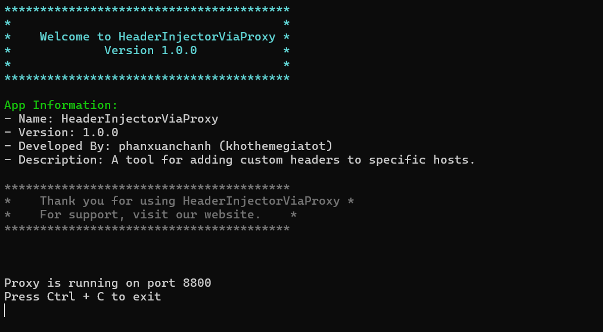

Supports blocking access by checking for the existence and matching value of x-special-code in the HTTP header, allowing access only when it exists and has a valid value.

A website with a specified host will be accessible only when a browser extension is installed on the computer, which adds x-special-code with a valid value.

## Windows Tools
#### HeaderInjectorViaProxy [C#, NET 9.0 Windows]

*Command: `HeaderInjectorViaProxy --port 8800`*

